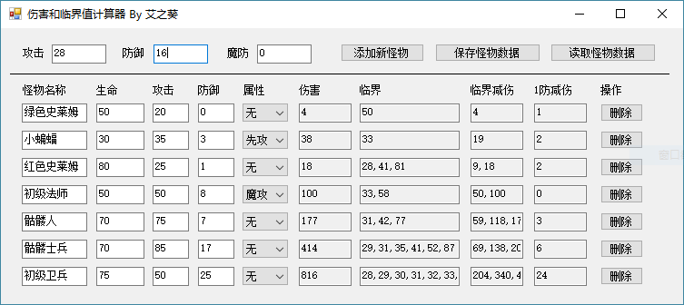

伤害与临界值计算器
================

### 软件说明
本软件是为魔塔游戏所制作的“伤害和临界值计算器”，可以很方便看到每个怪物的伤害值，各临界值、临界减伤及1防减伤。

Windows 8可直接运行本软件，Windows 7需要安装.Net Framework 4.0方能正常运行。

本软件有如下特性：

  * 支持勇士的魔防属性，支持多种怪物并列查看数据。
  * 支持多种怪物属性：先攻、魔攻、坚固、2连击、3连击、4连击、破甲、反击、净化等。
  * 可以保存与读取怪物数据，十分方便。
  * 更多的特性期待你来发掘~

下载地址：https://tieba.baidu.com/p/5359225353

### 编译运行

请使用VS2012及以上进行编译运行。   
本软件可以任意进行修改成自己想要的样子。  

如果有问题，请邮件至 `ckcz123@126.com`，或在魔塔吧官方交流群中搜寻“小艾”以联系到我。  
